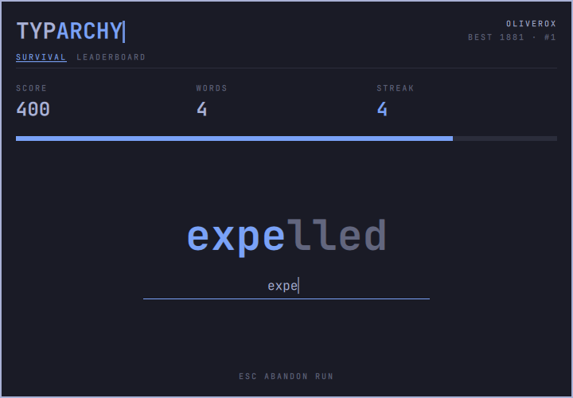
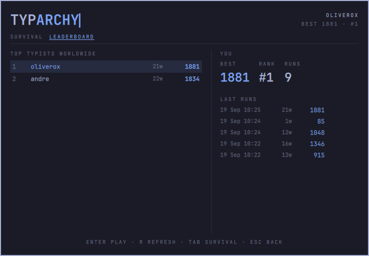

# Typarchy

Survival speed-typing for [Omarchy](https://omarchy.org), with a worldwide leaderboard.

One word at a time, one shrinking clock. Type the word before the bar empties;
every word makes the clock tighter. A wrong key breaks your streak.

It's a great workout for your brain, and a perfect way to spend the minutes while you
wait for your AI agent to finish its task. Hit the keybinding, play a round, and get
back to work when it's done.





The repo is both the Omarchy shell plugin (repo root) and its Convex backend (`backend/`).

## Install

```bash
omarchy plugin add https://github.com/oliverox/typarchy --enable
```

Or for local development, link the checkout:

```bash
ln -sfn ~/Work/typarchy ~/.config/omarchy/plugins/typarchy.game
omarchy-shell shell rescanPlugins
omarchy plugin enable typarchy.game
```

The shell doesn't watch files behind a symlink and caches loaded QML, so run
`omarchy restart shell` after editing to see changes.

Add a keybinding in `~/.config/hypr/bindings.lua`:

```lua
o.bind("SUPER + SHIFT + T", "Typarchy", "omarchy-shell shell toggle typarchy.game")
```

The bar widget (keyboard icon) shows your best score and rank. Left click plays,
right click opens the leaderboard.

## Uninstall

```bash
omarchy plugin remove typarchy.game
rm -rf ~/.local/state/typarchy   # optional: forget your nickname token and cached words
```

Removing the plugin doesn't delete your leaderboard entry. Remove any keybinding you added to
`bindings.lua` yourself.

## Dependencies and network use

Typarchy needs no extra packages beyond Omarchy's shell. The ranked mode talks over HTTPS to
the Typarchy leaderboard, a [Convex](https://convex.dev) deployment (`Config.js`). It sends
only your chosen nickname, its token, and run data: when each word was finished, how many
typos it took, and the timing of the keys that typed it (so the server can tell people
from scripts). Nothing else leaves your machine. Offline practice needs no network.

The `backend/` folder is the server code. You don't need to install it to play.

## Controls

| Key | |
|---|---|
| Enter | start a run / run it back |
| letters | type the word — it completes automatically when it matches |
| Backspace, Ctrl+Backspace, Ctrl+W | delete a letter / clear the word |
| Tab | switch between survival and leaderboard |
| R | refresh the leaderboard |
| Esc | abandon the run, leave the leaderboard, or close |

## Rules

- The first word gets 4.2s. Each completed word shrinks the next window by 3.5%, down to 1.2s.
- A word scores `letters × 10 + remaining time / 100ms`.
- A wrong keystroke breaks the streak but costs no time.
- Nobody reads and types faster than 150ms for the first key plus 35ms per further letter, so
  a word completed sooner doesn't count.
- The run ends when the clock hits zero.

Rules live in `backend/convex/lib/rules.ts` and are mirrored in `Rules.js`;
`npm test` in `backend/` replays simulated runs through both to keep them identical.

## How ranking works

- **Nicknames, no accounts.** Claiming a nickname returns a secret token stored in
  `~/.local/state/typarchy/identity.json` (directory mode 700). Lose the file, lose the name.
- **Server-run sessions.** The server starts each run and issues its words. The client
  checks in every 10 words (and receives more words), then submits per-word timestamps
  and typo counts. The server replays the run with the same rules, computes the score
  itself, and rejects runs whose timing doesn't line up with its own clock (paused or
  invented timestamps, impossibly fast words).
- **Keystroke timing.** Each word carries the times of the keys that typed it. People type
  unevenly; scripts keep a steady beat. Runs whose keystrokes or reaction times are too
  even to be human are rejected (`backend/convex/lib/humanity.ts`).
- **Review.** A run that would raise a player's best is held for review instead of going
  straight to the board when it looks unusual: very fast typing or reactions, fairly even
  keystrokes, no typos over 60+ words. The same goes for any new #1, and, once the board has 25
  players, any run entering the top 10. It shows as "review" in your last runs until an
  admin approves it.
- **Rate limits.** Each player can start 30 runs at once and 60 per hour after that.
  Nickname claims are capped at 20 per hour across everyone.
- **What this doesn't stop.** The client is open source, so a script can always play like
  the real game does. These checks stop score forging, scripts at a steady beat and
  superhuman runs. A careful bot that fakes human timing at top-human speed can still get
  through, and review is where it gets caught.
- **Offline.** If the leaderboard is unreachable the game falls back to an unranked
  practice run using words cached from your last ranked run.

## Words

Words come from Wiktionary, not from this repo. `wordSync.refresh` pulls the
[English Wikipedia (2016) frequency list](https://en.wiktionary.org/wiki/Wiktionary:Frequency_lists/English/Wikipedia_(2016))
through the Wiktionary API, keeps lowercase 3–12 letter words, and drops anything in
Wiktionary's English vulgarity, offensive, slur, and swear-word categories. It runs
weekly via cron and stores the pool in Convex.

## Backend

```bash
cd backend
npm install
npx convex dev                       # dev deployment, writes .env.local
npx convex run wordSync:refresh      # fill the word pool (≈30s)
npm test
```

The plugin talks to the URL in `Config.js` (override with `TYPARCHY_CONVEX_URL` in the
shell's environment).

### Going to production

```bash
cd backend
npx convex deploy
npx convex run --prod wordSync:refresh
```

Then set `Config.js` → `convexUrl` to the production deployment URL.

### Moderation

Admins review held runs in the game: the leaderboard tab lists them with approve and
reject buttons. Only players flagged as admin see the list, and the server checks the flag
on every call, so a modified client gets nowhere. The flag can only be set with deploy
access:

```bash
npx convex run admin:setAdmin '{"name":"someone","isAdmin":true}'
```

The same review works from the command line:

```bash
npx convex run admin:pendingRuns                           # runs held for review, with why
npx convex run admin:approveRun '{"runId":"..."}'           # rank it
npx convex run admin:rejectRun '{"runId":"..."}'            # keep it off the board
npx convex run admin:removePlayer '{"name":"someone"}'      # delete a player and their runs
```

Add `--prod` to run these against production.

## License

[MIT](LICENSE)
