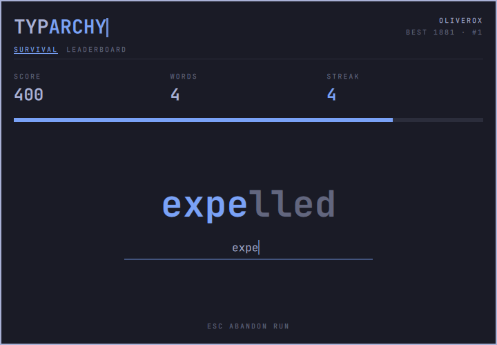
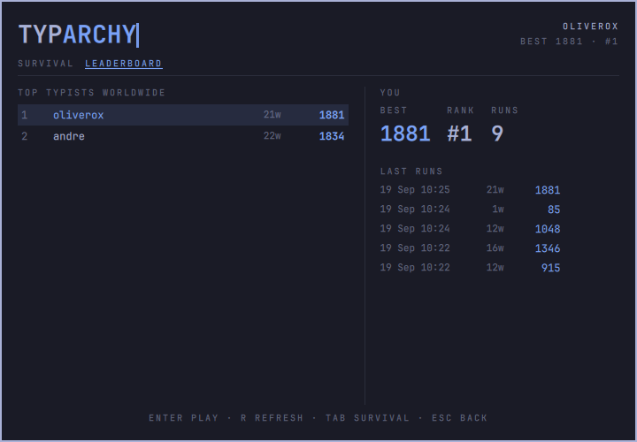

# Typarchy

Survival speed-typing for [Omarchy](https://omarchy.org), with a worldwide leaderboard.

One word at a time, one shrinking clock. Type the word before the bar empties;
every word makes the clock tighter. A wrong key breaks your streak.

It's a great workout for your brain, and a perfect way to spend the minutes while you
wait for your AI agent to finish its task. Hit the keybinding, play a round, and get
back to work when it's done.





The repo is both the Omarchy shell plugin (repo root) and its Convex backend (`backend/`).

## Install

```bash
omarchy plugin add https://github.com/oliverox/typarchy --enable
```

Or for local development, link the checkout:

```bash
ln -sfn ~/Work/typarchy ~/.config/omarchy/plugins/typarchy.game
omarchy-shell shell rescanPlugins
omarchy plugin enable typarchy.game
```

The shell doesn't watch files behind a symlink and caches loaded QML, so run
`omarchy restart shell` after editing to see changes.

Add a keybinding in `~/.config/hypr/bindings.lua`:

```lua
o.bind("SUPER + SHIFT + T", "Typarchy", "omarchy-shell shell toggle typarchy.game")
```

The bar widget (keyboard icon) shows your best score and rank. Left click plays,
right click opens the leaderboard.

## Update

```bash
omarchy plugin update typarchy.game
omarchy restart shell
```

The shell keeps Typarchy loaded, so the update only takes effect after the restart.
Until then you're still playing the old version, and the leaderboard may refuse its runs.

## Removing

```bash
omarchy plugin remove typarchy.game
```

What stays behind:

- `~/.local/state/typarchy/` (0700): `identity.json` holds your nickname and its secret token,
  `profile.json` your best score, rank and the words cached for offline practice. Both are
  0600. Removing the plugin keeps them so you can reinstall without losing your nickname;
  delete the two files yourself to forget them. `~/.local/state/typarchy-dev/` exists only if
  you pointed the game at a local backend.
- Your leaderboard entry. Removing the plugin doesn't delete it.
- Any keybinding you added to `bindings.lua`; remove it yourself.

## Dependencies and network use

Typarchy needs no extra packages beyond Omarchy's shell. The ranked mode talks over HTTPS to
the Typarchy leaderboard, a [Convex](https://convex.dev) deployment (fixed in `bin/typarchy-api`). It sends
only your chosen nickname, its token, the country you picked for your flag (if any), and run data: when each word was finished, how many
typos it took, and the timing of the keys that typed it (so the server can tell people
from scripts). Nothing else leaves your machine. Offline practice needs no network.

Two small helpers do the I/O, both Python standard library run with the system `python3`:
`bin/typarchy-api` makes the leaderboard calls (that one host only, no redirects or proxies,
replies capped at 256 KiB, your token passed on stdin), and `bin/typarchy-state` reads and
writes the only two files the game keeps, in `~/.local/state/typarchy/` (see Removing). It
refuses symlinks and oversized files and creates them 0600.

The `backend/` folder is the server code. You don't need to install it to play.

## Controls

| Key | |
|---|---|
| Enter | start a run / run it back |
| letters | type the word — it completes automatically when it matches |
| Backspace, Ctrl+Backspace, Ctrl+W | delete a letter / clear the word |
| Tab | switch between survival and leaderboard |
| R | refresh the leaderboard |
| Esc | abandon the run, leave the leaderboard, or close |

## Rules

- The clock starts at 4.2s. Each completed word shrinks it by 3.5%, down to 1.2s.
- That clock is for a 7-letter word. Each word's time scales with its letters plus two
  letters' worth of reaction time, so every word asks for the same pace: at the start
  "axe" gets 2.3s and "accomplished" 6.5s, at the 1.2s clock 0.67s and 1.9s.
- A word scores `letters × 10 + remaining time / 100ms`.
- A wrong keystroke breaks the streak but costs no time.
- Nobody reads and types faster than 150ms for the first key plus 35ms per further letter, so
  a word completed sooner doesn't count.
- The run ends when the clock hits zero.

Rules live in `backend/convex/lib/rules.ts` and are mirrored in `Rules.js`;
the backend tests replay simulated runs through both to keep them identical.

## How ranking works

- **Nicknames, no accounts.** Claiming a nickname returns a secret token stored in
  `~/.local/state/typarchy/identity.json` (file mode 600, directory 700). Lose the file, lose the name.
- **Flags.** When you claim a nickname the game suggests a country from your system
  timezone (read from tzdata on your machine, no network lookup). Change it with ← →
  or pick "no flag" before you confirm; press `c` on the leaderboard to change it later.
  Only the two-letter code is stored, and it shows as a flag next to your name, with the
  country's name on hover.
- **Server-run sessions.** The server starts each run and issues its words. The client
  checks in every 10 words (and receives more words), then submits per-word timestamps
  and typo counts. The server replays the run with the same rules, computes the score
  itself, and rejects runs whose timing doesn't line up with its own clock (paused or
  invented timestamps, impossibly fast words).
- **Keystroke timing.** Each word carries the times of the keys that typed it. People type
  unevenly; scripts keep a steady beat. Runs whose keystrokes or reaction times are too
  even to be human are rejected (`backend/convex/lib/humanity.ts`).
- **Review.** A run that would raise a player's best is held for review instead of going
  straight to the board when it looks unusual: very fast typing or reactions, fairly even
  keystrokes, no typos over 60+ words. The same goes for any new #1, and, once the board has 25
  players, any run entering the top 10. It shows as "review" in your last runs until an
  admin approves it.
- **Rate limits.** Each player can start 30 runs at once and 60 per hour after that.
  Nickname claims are capped at 20 per hour across everyone.
- **What this doesn't stop.** The client is open source, so a script can always play like
  the real game does. These checks stop score forging, scripts at a steady beat and
  superhuman runs. A careful bot that fakes human timing at top-human speed can still get
  through, and review is where it gets caught.
- **Offline.** If the leaderboard is unreachable the game falls back to an unranked
  practice run using words cached from your last ranked run.

## Words

Words come from Wiktionary, not from this repo. `wordSync.refresh` pulls the
[English Wikipedia (2016) frequency list](https://en.wiktionary.org/wiki/Wiktionary:Frequency_lists/English/Wikipedia_(2016))
through the Wiktionary API, keeps lowercase 3–12 letter words, and drops anything in
Wiktionary's English vulgarity, offensive, slur, and swear-word categories. It runs
weekly via cron and stores the pool in Convex.

## Backend

The `backend/` folder holds the leaderboard server. See [`backend/README.md`](backend/README.md)
for setup, deploying, and moderation.

## License

[MIT](LICENSE)
